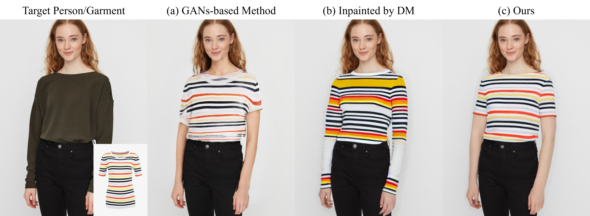

# DCI-VTON-Virtual-Try-On
This is the official repository for the following paper:
> **Taming the Power of Diffusion Models for High-Quality Virtual Try-On with Appearance Flow** [[arxiv]](https://arxiv.org/pdf/2308.06101.pdf)
>
> Junhong Gou, Siyu Sun, Jianfu Zhang, Jianlou Si, Chen Qian, Liqing Zhang  
> Accepted by **ACM MM 2023**.
## Overview

> **Absreact**
> Virtual try-on is a critical image synthesis task that aims to transfer clothes from one image to another while preserving the details of both humans and clothes.
> While many existing methods rely on Generative Adversarial Networks (GANs) to achieve this, flaws can still occur, particularly at high resolutions.
> Recently, the diffusion model has emerged as a promising alternative for generating high-quality images in various applications.
> However, simply using clothes as a condition for guiding the diffusion model to inpaint is insufficient to maintain the details of the clothes.
To overcome this challenge, we propose an exemplar-based inpainting approach that leverages a warping module to guide the diffusion model's generation effectively.
> The warping module performs initial processing on the clothes, which helps to preserve the local details of the clothes.
> We then combine the warped clothes with clothes-agnostic person image and add noise as the input of diffusion model.
> Additionally, the warped clothes is used as local conditions for each denoising process to ensure that the resulting output retains as much detail as possible.
> Our approach, namely Diffusion-based Conditional Inpainting for Virtual Try-ON (DCI-VTON), effectively utilizes the power of the diffusion model, and the incorporation of the warping module helps to produce high-quality and realistic virtual try-on results.
> Experimental results on VITON-HD demonstrate the effectiveness and superiority of our method.
## Todo
- [ ] Release training and inference code.
- [ ] Release pretrained models.
